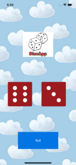

 

    
  </a>

  <h3 align="center">Dice App</h3>
  

   A simple IOS app which shows random dice faces by pressing a button or shaking the phone. 🎲
  

## UI

## Main Features
- When running the app it shows the new dice faces
- By pressing "Roll" the random dice faces are shown
- Motion detection is supported: by shaking the device the new dice faces change

Copyright (c) 2022 Assankhanov Arman
